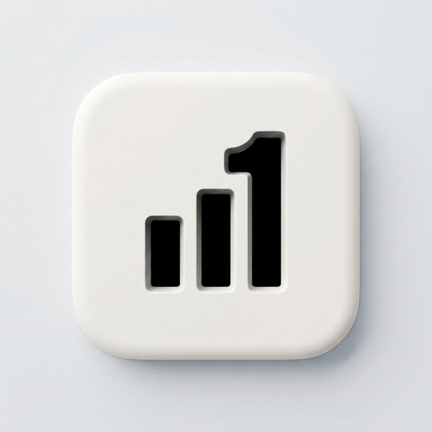

# trackOne — A privacy focused portfolio tracker for Android

<p align="center">
  
</p>

<p align="center">
  A minimal, dark-mode finance app and home-screen widget to track your<br/>
  watchlist, net worth, stocks, crypto, and more — local-first, with optional cloud backup.
</p>

<p align="center">
  
  
  
  
  
</p>

<p align="center">
  <a href="https://github.com/SaurabhChaudharyy/trackOne/releases/latest">
    
  </a>
</p>

---

## What's New in v1.3-beta

*   **Optional Sign-In & Cloud Backup**: Sign in with Google or email/password to back up and restore your watchlist and net worth data via Firestore. Entirely opt-in — the app works fully offline without an account.
*   **Refactored Settings**: Auth, cloud backup, and broker CSV import are now independent view models instead of one monolithic settings screen.
*   **Dark Mode**: In-app theme toggle (System default / Light / Dark), independent of the device's own setting.
*   **Optional Biometric App Lock**: Require fingerprint or device unlock to open the app.
*   **Daily Digest**: An optional once-a-day notification summarizing your best/worst performing holdings and overall portfolio P&L.

## What's New in v1.2

*   **Highlighter Aesthetic Revamp**: Brand new bold, high-contrast UI.
*   **Portfolio Chart Integration**: View your portfolio's performance via an intuitive, interactive line chart directly on the Home Screen.
*   **Polished Asset Management**: Replaced standard popup menus with smooth `BottomSheetDialog`s for editing and deleting assets.
*   **Improved Bulk Deletion**: Enhanced multi-select UI with a persistent bottom action bar and polished confirmation dialogs.
*   **Dynamic UI Elements**: Timeframe chips, P&L markers, and action buttons have all been redesigned to align with a cohesive, premium light-theme.

---

## 📲 Download & Install

1. Tap the **Download APK** badge above (or go to [Releases](https://github.com/SaurabhChaudharyy/trackOne/releases/latest))
2. Download the `.apk` file onto your Android device
3. Go to **Settings → Install unknown apps** and allow installs from your browser or file manager
4. Open the `.apk` file and tap **Install**

> Requires Android 8.0 (Oreo) or higher. No Play Store — direct sideload only.

---


## Features

| Tab | What it does |
|---|---|
| **Markets / Watchlist** | Track any stock or crypto symbol. Live prices via Yahoo Finance. Tap any item for a full candlestick / line chart with 1D → 5Y timeframes. |
| **Net Worth** | Add assets across 7 categories (Indian Stocks, US Stocks, Mutual Funds, Gold, Crypto, Cash, Bank). Collapsible sections. Auto-fetches current price for symbol-based assets. |
| **Settings** | Import holdings directly from your broker's CSV/XLSX export (HDFC Securities, Angel One, Zerodha, Groww, Vested, Interactive Brokers). Optionally sign in with Google or email/password to back up your watchlist + net worth data to the cloud and restore it on another device. Toggle theme, biometric app lock, and the daily digest notification. |
| **Home-screen Widget** | Scrollable stock list widget that updates in the background via WorkManager. Tap any row to open the detail screen. |

---

## Tech Stack

| Layer | Library |
|---|---|
| Language | Kotlin |
| UI | Android XML Views + Material 3 |
| Architecture | MVVM |
| Database | Room (KSP) |
| Dependency Injection | Dagger Hilt (KSP) |
| Networking | Retrofit + OkHttp + Gson |
| Background work | WorkManager |
| Image loading | Glide |
| Charts | MPAndroidChart |
| Async | Kotlin Coroutines |
| Optional cloud backup | Firebase Auth + Cloud Firestore |
| Crash reporting | Firebase Crashlytics |

---

## Data & Privacy

- **Local-first by default**: all data is stored locally on your device in a Room (SQLite) database. No account is required to use the app.
- **No ads, no third-party trackers** — ever, whether or not you sign in.
- **Cloud Backup is entirely opt-in**: sign in with Google or email/password only if you want to back up your watchlist and net worth data to the cloud (Firestore) and restore it on another device. If you never sign in, nothing leaves your device.
- Stock/crypto prices are fetched from the public Yahoo Finance API — no API key required.
- **Crash reporting**: Firebase Crashlytics collects crash logs and basic device info (model, OS version, app version) to help fix bugs — this runs regardless of sign-in status, but never includes your portfolio data.
- Full details: see [PRIVACY.md](PRIVACY.md).

---

## Building

### Prerequisites
- Android Studio Hedgehog (2023.1.1) or newer
- JDK 17
- Android SDK 34

### Steps

```bash
# 1. Clone the repo
git clone https://github.com/YOUR_USERNAME/trackOne.git
cd trackOne

# 2. Open in Android Studio — it will sync Gradle automatically
# OR build from the command line:
./gradlew assembleDebug

# 3. Install on a connected device / emulator
./gradlew installDebug
```

> **Note:** No API keys are needed. The app uses the public Yahoo Finance endpoint.

---

## Project Structure

```
app/src/main/
├── data/
│   ├── api/            # Retrofit service (Yahoo Finance)
│   ├── database/       # Room entities, DAOs, database class
│   ├── model/          # API response models
│   └── repository/     # StockRepository, NetWorthRepository, BrokerCsvRepository, CloudBackupRepository, AuthRepository
├── di/                 # Hilt AppModule
├── notifications/      # NotificationHelper (channels + builders)
├── ui/
│   ├── config/         # Widget configuration activity
│   ├── detail/         # Stock detail screen + chart
│   ├── lock/           # Biometric app-lock gate
│   ├── main/           # MainActivity, Watchlist fragment + adapter
│   ├── networth/       # Net Worth fragment + adapter + ViewModel
│   ├── settings/       # Settings fragment + ViewModel
│   └── widget/         # AppWidgetProvider + RemoteViews service
├── utils/              # FormatUtils, Resource wrapper, PortfolioGainLoss, CurrencyConversion, SymbolUtils
└── workers/            # StockUpdateWorker, DailyDigestWorker (WorkManager)
```

---

## Known Limitations

- Yahoo Finance's public API is unofficial and may occasionally rate-limit or return stale data.
- The home-screen widget uses `RemoteViews`, which has strict constraints — complex layouts and custom attributes are not supported inside widget XMLs.
- Cloud Backup is manual and one-way in each direction, not continuous background sync — tapping **Restore** replaces local data with whatever's in your last cloud backup. Without signing in, there is currently no way to move data between devices other than re-importing your broker CSV/XLSX on the new device.
- The Daily Digest's "best/worst performing holding" is cumulative gain/loss since purchase, not today's price movement — it can repeat the same 1-2 holdings on consecutive days.

---

## Contributing

Pull requests are welcome. For major changes, please open an issue first to discuss what you'd like to change.

1. Fork the repo
2. Create a feature branch (`git checkout -b feature/my-feature`)
3. Commit your changes (`git commit -m 'feat: add my feature'`)
4. Push to the branch (`git push origin feature/my-feature`)
5. Open a Pull Request

```
